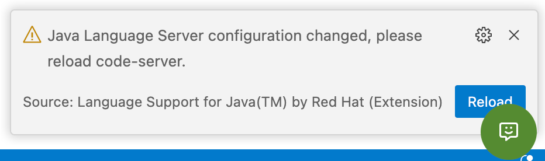

## Introduction

Running a Spring application in Kubernetes can be a daunting task. You need to containerize the application, either by using Spring Boot tools, or manually via a Dockerfile. Once the container image has been created on your machine, you need to push it to a container registry. You then need to write a series of complex YAML files to deploy and run the container image as a Kubernetes deployment along with a service to expose it over the Internet and get an URL that you can use to test your application.

In this guide, you will go from zero to URL without having to directly deal with construction of container images, and authoring YAML files.

## Lab environment

The lab environment provides you with a fully working Kubernetes cluster where [Tanzu Application Platform (TAP)](https://tanzu.vmware.com/application-platform) has been installed. You will use the embedded version of VS Code as your code editor in which a couple of Tanzu extensions have been installed for you. These extensions provide the glue between you and the cluster allowing you to run the containerized application in Kubernetes with a simple click.

NOTE: The Tanzu extensions are also available for IntelliJ and Visual Studio (the full blown IDE from Microsoft).

## Create a Spring application

You will start by creating a brand new Spring application using a template that is available from TAP. These templates are called **accelerators** because they help you accelerate the development process by providing a boilerplate project.

To create the project:

1. Open the editor.
1. From the sidebar menu, click on the **Tanzu App Accelerator** button. The extension will display a list of accelerator projects.
1. Locate and click on the **Tanzu Java Web App** accelerator.


The extension will display a series of parameters that you can set. These are customizable when you or your team create accelerators.

1. Select Spring Boot 3.0 or higher as the **Spring Boot version**.
1. For the Java version, select **Java 17**.
1. Click the **Next Step** button.
1. Click the **Generate Project** button. This will open the VS Code command palette prompting you for a folder location.
1. When prompted to select a folder, click **OK**. The project will be created in the `tanzu-java-web-app` folder.
1. If you're prompted to open the project in a new window, select **No**.

The project is now loaded into VS Code. The Java and the Tanzu extensions will soon start analysing the project. This can take a few seconds.

You will see two prompts poping up, one from the Tanzu Developer Tools extension reporting an error. Click on the **Update Workspace Settings** button to set the Java language launch mode to Standard.


Click **Reload** when prompted to reload the project.



A second prompt asks you to enable null analysis or not, click **Disable** as this is not important for completing the guide's steps.

If you look at the project’s files, you will see that they consist of source code files that you would use for a starter application along with some generated files that will give Tanzu Application Platform additional context for working with the application.

Open the `src` folder and drill down until you can select the `HelloController.java` file. This is the main application file. It contains the code that will be executed when the application is started and will output: `Greetings from Spring Boot + Tanzu!`.

```bash
Hint: src/main/java/com/example/springboot/HelloController.java
```

```java
package com.example.springboot;

import org.springframework.web.bind.annotation.RestController;
import org.springframework.web.bind.annotation.RequestMapping;

@RestController
public class HelloController {

	@RequestMapping("/")
	public String index() {
		return "Greetings from Spring Boot + Tanzu!";
	}

}
```

## Test the application locally

Test the application locally by right-clicking on the Application.java file and selecting **Run Java**. VS Code will compile and run the application.

The application will listen on port 8080. VS Code will display a popup in the lower right corner of the screen. Click on the **Open in Browser** button to display the app in a browser window.

If the popup disappeared before you had a chance to click on the button, no problems. Simply click on the **Ports** tab to list the ports currently opened, locate port 8080 and click on the **View in Browser** icon (the globe) to display the app.


To stop the application, click on the _Stop_ icon located in the debugger toolbar at the top of the screen.


## Deploy the application

Time to deploy the application to the Kubernetes cluster by using the Tanzu extension. With VS Code, there are two ways to send commands to the extension. The first method is by opening the VS Code command palette.

1. Click on the **main menu** icon, sometimes referred to as the hamburger menu.
1. Select **View** and **Command Palette…**.


In the Command Palette, type `tanzu` to retrieve all the Tanzu commands that you can trigger. In that list, you’ll find commands that allow you to deploy a workload and to start the Live Update. What is a workload? Is just the way TAP calls applications that you deploy in Kubernetes.

The second method you can use to trigger a command is by using your mouse and right-clicking anywhere in the file explorer section. At the bottom of the popup menu, you’ll find the same commands you saw earlier using the Command Palette.

_"Apply a workload"_ is the Tanzu way of saying _"deploy an application"_. To apply a workload, right-click anywhere in the VS Code project explorer, or open the Command Palette, and select the **Tanzu: Apply Workload** command.

The following screenshot shows the use of the Right-Click menu:


You will be prompted by the Tanzu Workloads panel to watch the namespace, click the **Watch Namespaces & Apply** button. This will enable the panel to display live information about the workloads running in the cluster.


A terminal panel will open and you will see some activity. The process will take about five minutes to complete and will display **Workload “tanzu-java-web-app” is ready** when done.


To get the URL of the running application, switch to the terminal and type:

```bash
$ tanzu apps workload get tanzu-java-web-app
```

The command will output the workload status with the information divided in several sections. Locate the section at the end called **Knative Services**. It will display the status of the workload and the URL to reach it. Clicking on the URL will launch the app in a new browser tab.

Note: It may take a few minutes for the status to change from **Unknown** to **Ready**.


In VS Code, the Tanzu extension also displays information about the running workloads in the Tanzu Workloads panel.


## What just happened?

Let’s take a step back and understand what just happened here. The code was packaged and sent to the cluster where it was containerized and stored in a container registry, then ran as a deployment in Kubernetes along with the required services to expose it over the Internet. All you did was _Right-click + Tanzu: Apply workload_. You went from zero to URL with a single command!

## Live Update

Now that the application is running, you’d like to make a code change. One cool feature of Tanzu is called **Live Update**. In a nutshell, it allows you to deploy and test code changes directly to a running application in Kubernetes.

The Tanzu extension enables you to deploy your workload once, save code changes, and see those changes reflected in the workload running on the cluster within seconds. How does this works? The extension relies on [Tilt](https://tilt.dev/), an open-source tool that watches for changes in the file system and triggers new deployment over an existing running application.

To start Live Update:

1. Right-click anywhere in the VS Code project explorer or open the Command Palette.
1. Select the **Tanzu: Live Update Start** command.

The following screenshot shows the use of the Command Palette:


Oh no! There's an error showing up in VS Code's terminal.


Actually no, it's Tilt warning us that you might be enabling Live Update on a production server. Imagine that you work with both a test and a production cluster. You'd want to use Live Update on the test server only. So how can you tell Tilt that this is OK on _this_ cluster? I you read the message, Tilt tells you how: by adding the following line at the top of the Tiltfile. Now talk about a useful warning message! Thanks Tilt!

Copy the following line, open the Tiltfile and paste it as the first line.

```bash
allow_k8s_contexts('tap-sandbox')
```


Tilt will restart and deploy the application. It will take a minute and you'll see a prompt saying that the app is running on port **8080**. Click the **Open in Browser** button.


Now that you enabled Live Update, it’s time to make some code changes. Open the `HelloController.java` file and modify the greeting message. VS Code will automatically save the change.

```bash
Hint: src/main/java/com/example/springboot/HelloController.java
```

Switch to the browser window that you opened earlier and refresh the page. The edited greeting message should be displayed. If you don't see the update, wait a few seconds and refresh that page again.

Take a look at the Tanzu Workloads panel, it will display the Live Update status.


To stop Live Update, select the terminal that Live Update opened to run the it's commands and click on the trash icon.


## What just happened?

Let’s take a step back and understand what just happened here. VS Code has saved the code change automatically and Tilt detected the change and sent the updated code to the cluster using the settings found in the Tiltfile. To make this happening, some configuration is required on the cluster and TAP takes care of that. All you have to do is focus on your code, not the infrastructure.

## Delete the workload

Deleting a workload is as simple as deploying one. Using the Command Palette or the popup menu, simply select **Delete Workload** and the workload will be deleted on the cluster and be removed from the Tanzu Workloads panel. You can also validate by typing this command at the terminal:

```bash
$ tanzu apps workload get tanzu-java-web-app
```

## Summary

Congratulations! You deployed and ran a Spring application on a Kubernetes cluster without explicitly building a container image or authoring a single line of YAML! Learning and using Kubernetes can be hard but using the right tools greatly simplifies this process and makes you more productive.

If you’d like to learn more about Kubernetes, there are many fine courses available for free on [KubeAcademy](https://kube.academy?utm_source=spring-academy&utm_medium=lesson-linkl&utm_content=tap-guide) and if you’d like to learn more about Tanzu Application Platform, head to [Tanzu Academy](https://tanzu.academy?utm_source=spring-academy&utm_medium=lesson-linkl&utm_content=tap-guide).
